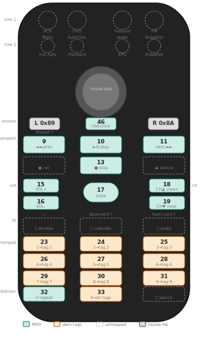

# edio-remote-runit
### eDio USB Remote Control for Artix Linux + runit

<p align="center">
  
  &nbsp;&nbsp;&nbsp;
  
</p>
<p align="center">
  <em>Left: actual hardware &nbsp;|&nbsp; Right: button code map (green = MPD, purple = dwm tags, dashed = unmapped)</em>
</p>

Controls MPD and dwm via a Cypress Semiconductor eDio USB Multi Remote Controller
(idVendor=147a, idProduct=e006). Reads raw 4-byte HID reports directly from
`/dev/hidraw` — no LIRC required.

---

## Requirements

- Artix Linux (rolling)
- runit as init system
- X11 with dwm as window manager
- Alt as dwm MODKEY
- MPD configured and running
- PipeWire for audio
- ncmpcpp as MPD client

---

## Hardware

This setup is specific to the eDio USB Multi Remote Controller. It will not work
with other remotes without modifying the HID report parsing in `remote-daemon.py`.

### Protocol

The device sends 4-byte HID reports on a single Consumer Control interface:

```
byte 0: 0x40 = remote button event  |  0x88+ = mouse event
byte 1: 0x00 = press, 0x80 = release  |  signed delta X
byte 2: button code                   |  signed delta Y (inverted)
byte 3: 0x0F always (footer)
```

Mouse clicks are encoded in byte 0: `0x89` = left click, `0x8A` = right click.

Note: button `64` (0x40) is permanently unusable — its value aliases with the
protocol framing byte.

---

## Before running install.sh

**1. Check your MODKEY**
The installer assumes dwm uses `Mod1` (Alt) as MODKEY. If yours uses `Mod4`
(Super/Windows key), edit `remote/remote-daemon.py` and change `alt+N` to
`super+N` in BUTTON_MAP before installing.

**2. Check your DISPLAY**
The daemon defaults to `DISPLAY=:0`. If your X display is different, check
with `echo $DISPLAY` and edit `remote/run` accordingly.

**3. MPD must be reachable**
Test with `mpc status` before installing. If MPD is on a non-default host
or port, add `-h` and `-p` flags to every `mpc` command in BUTTON_MAP.

**4. You will need sudo**
The installer copies udev rules to `/etc/udev/rules.d/`, loads kernel modules,
and adds your user to the `input` group.

**5. A logout is required**
After install.sh completes you must log out and back in before starting the
service, so the `input` group membership takes effect.

**6. The remote must be plugged in**
The udev symlink `/dev/hidraw-remote` is created when the device is detected.
Plug in the remote before starting the service.

---

## Installation

```bash
git clone <repo-url> ~/dotfiles
cd ~/dotfiles
chmod +x install.sh
./install.sh
```

Log out and back in, then:

```bash
sv start ~/.config/sv/remote-daemon
sv status ~/.config/sv/remote-daemon
tail -f ~/.local/share/log/remote-daemon/current
```

Press a button on the remote — you should see `Command [...] OK` in the log.

---

## Button map

> Codes verified across 3 independent scan runs. All 35 physical buttons accounted for.

### Row 1 — mode selectors (unmapped)
These buttons have no effect in the daemon. They were used by the original
Windows software to switch context for rows 2 and function row buttons.

| Code | Label    |
|------|----------|
| 1    | VCR      |
| 2    | DVD      |
| 35   | Teletext |
| 4    | FM       |

### Row 2 — context buttons (unmapped)
Each button has two printed labels — DVD mode above, VCR mode below.
The hardware sends the same code regardless of which mode button was pressed.

| Code | DVD label (above) | VCR label (below) |
|------|-------------------|-------------------|
| 5    | Menu              | —                 |
| 6    | Subtitles         | Playback          |
| 7    | Audio             | EPG               |
| 8    | Snapshot          | Snapshot          |

### Mouse pad
| Control     | Action          |
|-------------|-----------------|
| trackball   | cursor movement |
| left click  | left click      |
| right click | right click     |
| 46 mid-click | xdotool click 2       |

### Transport
| Code | Label    | Action     |
|------|----------|------------|
| 9    | ◄◄       | mpc prev   |
| 10   | ►/II     | mpc toggle |
| 11   | ►►       | mpc next   |
| 12   | ● rec    | unmapped   |
| 13   | ■ stop   | mpc stop   |
| 14   | ⏏ source | unmapped   |

### Volume / Channel
| Code | Label   | Action                       |
|------|---------|------------------------------|
| 15   | VOL+    | mpc volume +5                |
| 16   | VOL-    | mpc volume -5                |
| 17   | ◄× mute | toggle mute (saves/restores) |
| 18   | CH▲     | ncmpcpp view next            |
| 19   | CH▼     | ncmpcpp view prev            |

### Function row
DVD mode labels printed above each button in yellow.

| Code | DVD label above | Icon          | Action   |
|------|----------------|---------------|----------|
| 20   | —              | window/screen | unmapped |
| 21   | Bookmark       | calendar      | unmapped |
| 22   | Num Lock       | speaker+waves | unmapped |

### Numpad
| Code | Label | Action      |
|------|-------|-------------|
| 23   | 1     | dwm tag 1   |
| 24   | 2     | dwm tag 2   |
| 25   | 3     | dwm tag 3   |
| 26   | 4     | dwm tag 4   |
| 27   | 5     | dwm tag 5   |
| 28   | 6     | dwm tag 6   |
| 29   | 7     | dwm tag 7   |
| 30   | 8     | dwm tag 8   |
| 31   | 9     | dwm tag 9   |

### Bottom row
| Code | Icon              | Action               |
|------|-------------------|----------------------|
| 32   | ↺ circular arrows | mpc repeat           |
| 33   | 0                 | dwm view all tags    |
| 36   | 🔍 magnifier      | unmapped             |

### ncmpcpp view cycle order
`CH▲` / `CH▼` cycle through: playlist → browse → search → library →
playlist editor → tag → outputs → visualizer


---

## Unmapped buttons

Available for future use — add entries to `BUTTON_MAP` in
`~/.local/bin/remote-daemon.py` then restart:
```bash
sv restart ~/.config/sv/remote-daemon
```

| Code | Label              | Notes                          |
|------|--------------------|--------------------------------|
| 1    | VCR                | row 1 mode selector            |
| 2    | DVD                | row 1 mode selector            |
| 4    | FM                 | row 1 mode selector            |
| 35   | Teletext           | row 1 mode selector            |
| 5    | Menu / —           | row 2 context, mode-dependent  |
| 6    | Subtitles/Playback | row 2 context, mode-dependent  |
| 7    | Audio / EPG        | row 2 context, mode-dependent  |
| 8    | Snapshot           | row 2 context, mode-dependent  |
| 12   | ● rec              | transport row 2                |
| 14   | ⏏ source           | transport row 2                |
| 20   | window icon        | function row                   |
| 21   | calendar/Bookmark  | function row                   |
| 22   | audio/Num Lock     | function row                   |
| 46   | double-click       | mouse section centre button    |
| 36   | 🔍 magnifier        | bottom row right               |

---

## File layout

| Source                    | Destination                              |
|---------------------------|------------------------------------------|
| `remote/remote-daemon.py` | `~/.local/bin/remote-daemon.py`          |
| `remote/mpc-mute-toggle.sh` | `~/.local/bin/mpc-mute-toggle.sh`      |
| `remote/ncmpcpp-view.sh`  | `~/.local/bin/ncmpcpp-view.sh`           |
| `remote/run`              | `~/.config/sv/remote-daemon/run`         |
| `remote/log/run`          | `~/.config/sv/remote-daemon/log/run`     |
| `udev/99-edioremote.rules`| `/etc/udev/rules.d/`                     |
| `udev/99-uinput.rules`    | `/etc/udev/rules.d/`                     |

---

## Controlling the service

```bash
sv start   ~/.config/sv/remote-daemon   # start
sv stop    ~/.config/sv/remote-daemon   # stop
sv restart ~/.config/sv/remote-daemon   # restart
sv status  ~/.config/sv/remote-daemon   # status
```

Logs:
```bash
tail -f ~/.local/share/log/remote-daemon/current
```

---

## Troubleshooting

**Service won't start — `/dev/uinput` permission denied**
Make sure you logged out and back in after running install.sh. Verify with:
`groups | grep input`

**Service won't start — device not found**
Check the udev symlink: `ls -la /dev/hidraw-remote`
If missing: `sudo udevadm control --reload-rules && sudo udevadm trigger`

**Service starts but exits immediately**
Check the log: `tail -f ~/.local/share/log/remote-daemon/current`
Common cause: X not ready yet — the run script waits up to 30 seconds for
`xdotool getactivewindow` to succeed before launching the daemon.

**Buttons work but dwm tags don't switch**
Test manually: `DISPLAY=:0 xdotool key --clearmodifiers alt+1`
If this hits ncmpcpp instead of dwm, check your MODKEY in `config.h`.

**mpc commands fail**
Test manually: `mpc status`
If MPD is unreachable, check it's running: `sv status ~/.config/sv/mpd`

**Mouse cursor doesn't move**
Check the virtual mouse was created:
`grep -i mouse ~/.local/share/log/remote-daemon/current`
You should see `Virtual mouse created` near the top.

**Up/down on the mouse pad are reversed**
In `remote-daemon.py`, remove the negation on the `dy` line:
`dy = struct.unpack('b', bytes([b2]))[0]`

---

## Credits

Developed in collaboration with [Claude](https://claude.ai) (Anthropic), through
an iterative debugging session that involved:

- Identifying the device as a raw HID Consumer Control interface (no LIRC needed)
- Reverse-engineering the proprietary 4-byte report protocol from scratch using
  `evtest`, `usbhid-dump`, and direct `/dev/hidraw` inspection
- Decoding the `0x40` framing byte, `0x80` release flag, signed relative mouse
  axes, and click bitmask in the header byte
- Identifying the permanent `0x40` button collision and the centre pad sending
  as a remote button rather than a mouse click
- Building and hardening the daemon iteratively, including uinput virtual mouse,
  debouncing, structured logging, and runit service integration
